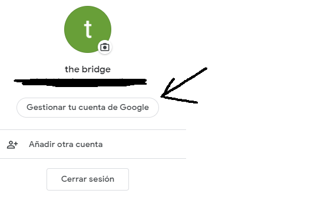
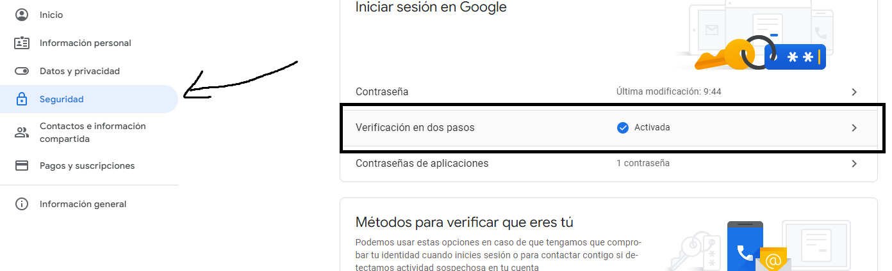
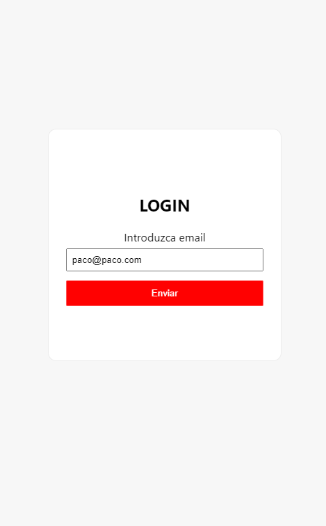
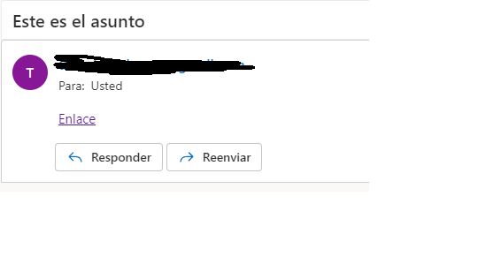
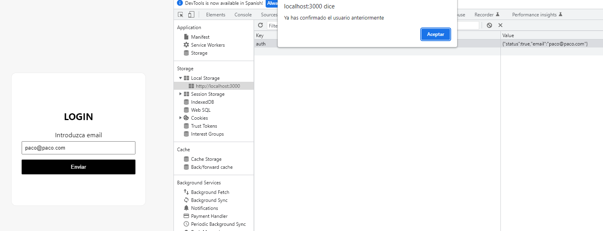

# [Bootcamp Web Developer Full Stack](https://www.thebridge.tech/bootcamps/bootcamp-fullstack-developer/)

### HTML, CSS, JS, ES6, Node.js, Frontend, Backend, Express, React, MERN, testing, DevOps

# RECUPERAR CONTRASEÑA MEDIANTE NODEMAILER

Para poder empezar , hay que crearse dos cuentas de correo.En este caso vamos a usar una de **gmail** y otra de **outlook**. La cuenta de **outlook** será la cuenta receptora y la de **gmail** la emisora.

1. Despues de crearnos una cuenta de **gmail** nos vamos a "Gestionar tu cuenta de Google/Seguridad/Verificación en dos pasos"



Cuando tengamos la cuenta con la **Verificación en dos pasos** nos vamos a **Contraseñas de aplicaciones**


Elegimos **Otra** y le asignamos un nombre, por ejemplo **nodemailer** y le damos a **generar**


A continuación nos saldrá una **Contraseña de aplicación**. 
# IMPORTANTE
Guarda esa contraseña ,porque la necesitamos para poder hacer el envío desde nuestro backend a la otra cuenta de correo, que será en los siguientes pasos


2. Una vez tengamos nuestra cuenta **emisora** preparada para poder enviar correos desde una app externa , procedemos a modificar el código. Vamos a utilizar el repo del **taller de jwt**:

- [TALLER JWT](https://github.com/igonzaleztb/TALLER_JWTJUNIO2022)

 

Lo primero que tenemos que hacer es irnos a nuestro backend e instalar lo siguiente:

```node
npm i nodemailer
```

Después en la raiz de nuestro proyecto nos creamos un script que le llamaremos **email.js** con el siguiente contenido

```js
const nodemailer = require("nodemailer")
const sendMail = (from,to, subject, html) =>{

     

      const transporter = nodemailer.createTransport({
        service:  "gmail",
        auth : {
            user : "TU_CUENTA_EMISORA_DE_CORREO",
            pass : "CONTRASEÑA_DE_APLICACIÓN_GENERADA"
        }
    })

    const options = {
        from, 
        to ,
        subject,    
        html
    }

    transporter.sendMail(options, (error, info) =>{
        if(error) console.log(error)
        else console.log(info)
    })  

}

 

module.exports =sendMail
```

A continuación vamos dentro del controllador **user.controllers.js** y agregamos todo este código

```js
const jwt = require("jsonwebtoken");
 

const fs = require("fs");
const sendMail = require("../email");

const SECRET = "tallerjwt";

const user = {
  confirmedUser: async (req, res) => {
    let emailUser = req.body.email;
 
    let idUsuario = 1;
 

    const payload = {
      email: emailUser,
      id: idUsuario,
    };

    const token = jwt.sign(payload, SECRET, { expiresIn: "15m" });

    const link = `<a href="http://localhost:5000/confirmuser/${idUsuario}/${token}">Enlace</a>`;
    
    sendMail("EMISOR", "CORREO_DESTINO" , "ASUNTO DEL MENSAJE",  `${link}`  )
 
  },

  checkUserPost: (req, res) => {
    const { email } = req.body;
    let objectToSave = { status: true, email: email };

    fs.writeFile(
      "archivo.json",
      JSON.stringify(objectToSave),
      "utf8",
      (err) => {
        if (err) throw err;
        console.log("Archivo guardado");
      }
    );
  },
  confirmUserGet: async (req, res) => {
    const { token } = req.params;

    try {
      jwt.verify(token, SECRET);

      res.render("confirmed-user");
    } catch (error) {
      res.send("No se puede confirmar el usuario, token inválido");
    }
  },
  dataUser: (req, res) => {
    const json = require("../archivo.json");

    console.log(json)
    if (!json) {
    } else {
      res.json(json);
    }
  },
};

module.exports = user;


```


3. Por último , al ejecutar nuestra aplicación en react e introducir el correo electrónico , si habeis introducido todos los datos correctos , os aparecerá un correo como el siguiente.



Después al hacer click sobre **Enlace**, os llevará a la página de recuperación de contraseña


Al final , si introducis la cuenta de correo que usaste anteriormente os dirá que ya teneis la cuenta confirmada


